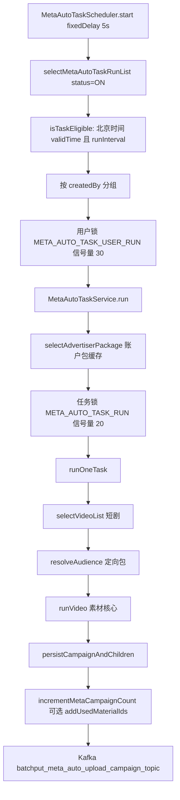
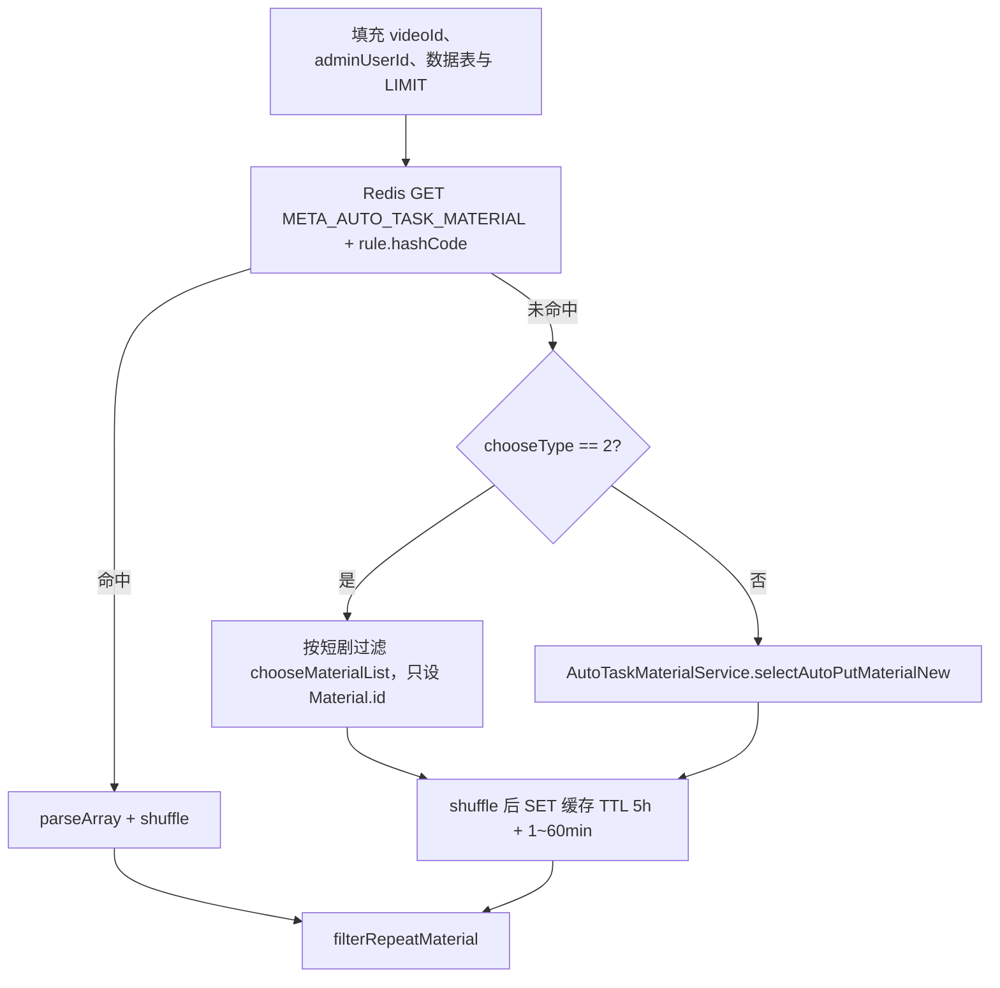

# Meta 自动任务：调度到落库的业务逻辑（重点：素材）

本文分两块：

1. **给运营看的配置说明**（短剧运行条件、素材、账户上限怎么配合，不讲代码）
2. **给研发看的调用链**（调度到落库并发 Kafka）

后续「上传系列 / 上传素材到 Meta」由独立 Listener / Scheduler 消费 MQ，研发部分只点到入口，不展开。

**覆盖范围**

- 调度扫描、时段与间隔、用户/任务锁
- 短剧、账户包、定向包
- 素材规则、查询、缓存、去重、按系列分配
- `persistCampaignAndChildren` 落库 + `batchput_meta_auto_upload_campaign_topic`

**不覆盖**

- `MetaAutoUploadCampaignListener` 调 Meta 创建系列
- `MetaAutoUploadMaterialScheduler` / `MetaAutoMaterialUploadListener` 上传视频与 image hash

**关键代码**

| 角色 | 类 |
|------|----|
| 调度入口 | `scheduler.auto.meta.MetaAutoTaskScheduler` |
| 任务编排 | `service.meta.auto.MetaAutoTaskService` |
| 素材 SQL（限流） | `service.auto.AutoTaskMaterialService` |
| 素材 SQL | `resources/mapper/MaterialMapper.xml` → `selectAutoPutMaterialNew` |
| Redis | `service.meta.auto.MetaAutoTaskRedisService` |
| 落库 | `service.meta.auto.MetaAutoTaskEntityPersistenceService` |
| 规则 DTO | `dto.meta.auto.MaterialRule` |

---

## 给运营看的配置说明（短剧、素材、账户上限）

下面用「任务在干什么」来讲，不讲代码。可以把它想成一条流水线：

**先圈定要投哪些短剧 → 再为每一部剧挑素材 → 再用账户包里的广告账户去建系列。**

三者是套在一起的，不是三套互不相干的开关。


---

### A. 短剧运行条件：决定「投哪些剧」

配置入口一般叫「短剧范围 / 开始运行条件」。

**当前真正生效的是：指定短剧。**  
保存任务时必须选出具体短剧列表。页面上历史上还有版权方、语种、剧本类型等筛选项，程序里已经不再用它们去自动扩剧——不会因为你选了「某版权方」就自动带上该版权下所有剧。

每一部被选中的短剧，还会带这些业务信息（配置在短剧条目上，不是全局一份）：

| 短剧上带的信息 | 作用（人话） |
|----------------|--------------|
| 短剧本身 | 后面所有素材、系列都按「这一部剧」分开算 |
| 定向包 | 这部剧的广告打给谁看。优先用短剧上绑的定向；没有才退回任务上的老定向。**没有定向，这部剧本轮直接跳过，不会建系列** |
| 语种 / 名称等展示信息 | 方便认剧，不参与「能不能建」 |

**要点：任务是「一部剧一部剧」跑的。**  
账户包是整份任务共用的，但素材池、已用素材、每个账户已经建了多少系列，都是 **「这个任务 + 这一部剧」** 分开记账。A 剧用过的素材，不会因为同任务就自动算作 B 剧也用过。

---

### B. 素材规则：决定「这部剧拿哪些片子去建广告」

素材永远跟在短剧后面：**先有剧，再按这部剧找素材。**  
不是先捞全库素材再往剧上贴。

#### 两种选法

**1）按规则筛选（默认）**

系统在「当前这部短剧」的素材库里，按你设的条件捞片子，例如：

- 素材创建时间（近几天）
- 数据不限，或按消耗、ROI、达标率等自定义门槛
- 自定义时还可限：收费/免费、Meta/TikTok、投放数据看最近几天还是累计
- 按消耗或 ROI 等排序，优先用表现更好的
- 数量：不限时最多取 1000 条；选固定数量则最多取你填的数（也封顶 1000）

还要满足权限：任务创建人必须能看到该素材所在文件夹，看不到的不会进池子。

**2）指定素材**

你手工勾选素材。系统只会使用 **勾选时绑定的短剧 ID = 当前正在跑的这部剧** 的那些。  
任务里选了 3 部剧、指定素材却只勾了剧 A 的片子：跑到剧 B 时会判定「没有素材」，剧 B 本轮不建。

保存时会校验：指定素材模式下必须已经选了短剧，且指定列表不能为空。

#### 和短剧的对应关系（务必记住）

| 场景 | 结果 |
|------|------|
| 剧在范围内，规则能筛出片子 | 这部剧可以进入建系列 |
| 剧在范围内，但规则太严 / 文件夹没权限 / 指定素材没挂这部剧 | 记「没有素材」，**跳过这部剧，不影响其他剧** |
| 开了「多轮不投重复素材」，这部剧的片子上一轮都用过了 | 池子被剔空，同样视为没有可用素材 |
| 有素材，但条数不够「每个系列要绑几条素材」 | 算不出完整一组，**一个系列都不建**（见下文举例） |

素材规则是任务级一份，但对每部剧会 **单独查一遍**（带上该剧 ID）。所以同一套「消耗 ≥ 100」在剧 A 可能有 80 条，在剧 B 可能 0 条。

---

### C. 一部剧里，素材怎么变成系列（和上限怎么咬在一起）

可以把它想成发牌：

1. 先给这部剧洗出一副「可用素材牌」
2. 每个系列要拿走固定张数（配置项：**广告组下素材数**，默认 30）。当前实现是：**一个系列里，一条素材对应一条广告**
3. **同一轮执行里，一张牌只能给一个系列**，不会同一轮把同一条素材塞进两个系列
4. 如果开了「多轮不投重复素材」，用过的牌会记在这部剧名下，下一轮不再发

**单轮单短剧计划创建上限**（配置项，默认 1）：这一轮、这一部剧，**最多打算建几个系列**。

但「打算」不等于「建得出来」。实际个数取两者中较小的：

- 你填的上限
- 素材牌还能凑出几整组（可用条数 ÷ 每个系列要的条数，除不尽的余数作废）

**例子 1**  
上限填 5，每系列 30 条素材，这部剧筛出 50 条 → 50÷30=1，**最多建 1 个系列**，不是 5。

**例子 2**  
上限填 5，每系列 30 条，筛出 90 条 → 可凑 3 组，再和 5 比，**最多建 3 个**。

**例子 3**  
上限填 5，每系列 30 条，筛出 20 条 → 凑不满 1 组，**一个都不建**。

**例子 4（指定数量再截一刀）**  
规则筛出 200 条，但素材数量选了「自定义 40」。系统先随机打乱，再只留前 40 条，再用 40 去凑系列。

---

### D. 账户相关：用哪些账户、怎样算「满了」

这里有三层，容易混，分开记。

#### 1）账户包：候选人名单

任务绑定一个 **投放账户包**。包里有哪些 Meta 广告账户，这部剧就只在这些账户上建系列。

账户包还带渠道、像素、收费/免费、投放方式（如 W2A / 直投）等，建系列时会一并带上。  
**包是任务级的：每部剧用同一份账户名单**，不会按剧再换一包账户。

没有账户包：整轮任务起不来（不会按剧重试换包）。

#### 2）单轮上限：这一轮还想不想再发牌

见上一节的「单轮单短剧计划创建上限」。它限制的是 **本轮给这部剧再新建多少个系列**（还要受素材够不够一组约束），**不是**「这个账户历史上总共只能有几个在投系列」。

遍历顺序可以理解为：

- 外层：还想再建第 1 个、第 2 个…直到达到「本轮上限」或素材发完
- 内层：账户包里挨个账户看——这个账户是不是已经被结束条件判定为「满了」；没满就尝试给它建一个系列（拿走一组素材）

所以：**上限是「这部剧本轮还能新建几个」，结束条件是「某个账户在这部剧上是不是已经够了」。** 两个一起卡。

#### 3）结束运行条件：这部剧在账户上怎样算投够了

表单要求填结束条件（通常要凑齐一组）。和账户真正打架的是下面这一对（程序实际在用的）：

| 配置 | 人话 |
|------|------|
| **单账户在投系列数** | 对「这个任务 + 这部剧 + 这个账户」已经建过的系列数（系统自己计的在投数）。达到你填的数字，这个账户本轮起视为 **满员，跳过，不再给它建** |
| **账户数** | 有多少个账户已经达到上面的「满员」。达到这个个数，**这部剧整段停建**（本轮后面账户也不再建） |

**例子（建议对照着填）**

账户包里有 10 个账户。  
单账户在投系列数 = 3，账户数 = 5。

含义：

- 某个账户在这部剧上已经记到 3 个系列 → 这个账户被跳过
- 一旦有 5 个账户都已经是「满 3 个」→ 这部剧认为目标达成，**不再给剩下 5 个账户补量**

注意：

- 计数是 **任务 + 短剧 + 账户** 分开的。剧 A 账户 1 满了，不影响剧 B 的账户 1。
- 数字是任务落库时就 +1 的，**不等系列在 Meta 后台创建成功**。上传失败时，这个「在投数」仍可能已经加上（和后台真实在投可能短暂不一致）。
- 配置项里还有「在投总系列数」这类文案时，**当前停建逻辑并没有按「全部账户加总」去停**；真正让账户停、让整剧停的，是上面的「单账户条数 + 满员账户个数」。

#### 4）和素材抢资源时谁说了算

同一轮里素材是「发完就没」的：

- 账户 1 拿走 30 条建成 1 个系列
- 账户 2 再拿 30 条
- 牌不够下一组时，**即使后面账户还没满、本轮上限也还没到，也会停**

因此会出现：结束条件还没达标，但日志是「没有素材 / 剩余素材不足」——不是账户配错了，是 **这部剧的可用片子不够再开一组**。

开了「多轮不投重复素材」后更明显：上一轮把池子用光，下一轮这部剧会一直「没有素材」，直到你关掉去重、换筛选，或等已用记录过期（很长，按设计约一年量级）。

---

### E. 整条链路用一个完整例子串起来

任务配置摘要：

- 短剧：剧 A、剧 B（各绑了定向）
- 账户包：账户甲、乙、丙（3 个）
- 每系列素材数：10
- 单轮单短剧上限：2
- 单账户在投系列数：2；账户数：2
- 素材：按规则筛选；多轮不重复：开

**跑剧 A 时**

1. 用规则只查「剧 A」的素材，假设捞到 25 条（未用过）。
2. 25÷10=2，上限也是 2 → 本轮剧 A 最多建 2 个系列。
3. 先看结束条件：假设三个账户在投都是 0，没人满员。
4. 给甲建 1 个（拿走 10 条），甲计数变 1；给乙建 1 个（再拿 10 条）。本轮上限 2 用完。剩下 5 条凑不够下一组。
5. 这 20 条记入「剧 A 已用素材」。

**同一轮再跑剧 B**

重新按剧 B 查素材，和剧 A 的已用列表无关。假设剧 B 指定素材漏配 → 「没有素材」，跳过。

**下一轮再跑剧 A**

已用 20 条被排除，只剩 5 条 → 凑不满 10 条一组 → 不建。  
若甲已有 2 个在投，甲会被跳过；若甲、乙都满 2，且账户数填 2 → 整部剧直接结束，不再建。

---

### F. 配置时常见误区

1. **以为素材规则是全任务共用一个大池再均分给各剧** — 实际是每部剧单独捞池子。  
2. **以为指定素材勾一次就所有剧都能用** — 必须按剧挂上对应素材。  
3. **上限填 10 却只出 1 个系列** — 先看可用素材 ÷ 每系列条数，再和上限比。  
4. **结束条件填了很大，账户却不建了** — 看是不是该账户已达「单账户在投数」，或整剧满员账户数已够，或素材发完。  
5. **「素材重复次数」类选项** — 页面/规则里可能还有「素材可重复几次」；**真正跨轮去重看的是任务上的「多轮不投重复素材」开关。** 本轮内即使关掉该开关，同一条素材也不会在同一轮进两个系列。  
6. **一部剧没定向** — 只跳过这部剧，其他剧继续。  
7. **生效时段、运行间隔** — 控制任务几点跑、隔多久跑一轮；不改变「剧—素材—账户」的对应关系，只决定什么时候再走一遍上述流程。

---

## 1. 总览与调用链



并发分层：

- **调度器**：按创建人分组，全局限流 30；同一用户一把锁，串行跑该用户本轮任务列表。
- **Service.run**：同一用户任务列表内最多并行 20 个任务；每个任务再加任务锁。

---

## 2. 调度层（简述）

入口：`MetaAutoTaskScheduler.start`，`@Scheduled(fixedDelay = 5000)`。

### 2.1 拉任务

`MetaAutoTaskMapper.selectMetaAutoTaskRunList`：`np_meta_auto_task` 且 `status = 'ON'`。

### 2.2 是否本轮可跑：`isTaskEligible`

同时满足：

1. **`isInValidTime`**  
   当前时间按 `Asia/Shanghai`。`validTimeList` 任一区间满足：`startTime < now < endTime`（开区间，整点边界不命中）。
2. **`isIntervalReady`**  
   - `lastFinishTime == null`：允许  
   - `runInterval` 空或 ≤0：允许  
   - 否则：`now - lastFinishTime ≥ runInterval 分钟`

### 2.3 用户锁与执行

- 按 `createdBy` 分组。
- 锁 key：`{batchput}:meta:auto:task:user:run:{userId}`，`tryLock` 10s。
- 锁内调用 `metaAutoTaskService.run(userId, taskList)`。
- `CompletableFuture.allOf(...).join()` 等本轮所有用户组结束。

### 2.4 任务内二次校验与收尾

`runOneTask` 开头再读库：

- 任务不存在或 `status=OFF`：跳过
- `isRunIntervalReadyOnDb`：与调度器同一套间隔规则，防多实例/DTO 过期

`finally` → `runLog`：

- 插入 `np_meta_auto_task_record`（`id` 为本轮 `recordId`）
- 更新任务 `lastFinishTime`

本轮开始会 `metaAutoTaskVideoLogsService.deleteLogsByTaskId`，再按短剧写运行日志。

---

## 3. 任务编排（到短剧循环）

`MetaAutoTaskService.run`：

1. `selectAdvertiserPackage`：按任务 `channelPackageId` 批量取账户包缓存，得到 `taskId → MetaAutoTaskChannelPackageCacheDto`。
2. 每个任务异步：锁 `{batchput}:meta:auto:task:run:{taskId}` → `runOneTask`。

`runOneTask`：

1. 生成 `recordId`（雪花）。
2. `selectVideoList`：短剧列表（Redis `META_AUTO_TASK_VIDEO_INFO + taskId`，TTL 约 12 小时 + 随机分钟；未命中则 `selectVideoCount`，当前主要解析 `runCondition` 中 **conditionType=7 指定短剧**）。
3. 无短剧：video log `没有可投放短剧`，return。
4. 无账户包：`NO_ACCOUNT`。
5. `buildVideoInfoMap`：从指定短剧条件解析 `shortPlayId → VideoInfo`（含短剧级定向）。
6. 按短剧循环：任务关闭则 break；`resolveAudience` 优先短剧 `audienceId`，否则任务级 `audienceId`；无定向 `NO_AUDIENCE`。
7. `runVideo(...)`。

---

## 4. 素材核心

素材发生在 `runVideo`。流程：查池 → 截断数量 → 算系列上限 → 按账户建系列时从池里「本轮不重复」取走素材 → 落库。

### 4.1 规则模型 `MaterialRule`

任务字段 `materialRule` 存 JSON，运行时 `task.getMaterialRuleObj()`。

| 字段 | 含义 | 运行时用法 |
|------|------|------------|
| `chooseType` | 1 按规则；2 指定素材 | 2 时不走 SQL，用 `chooseMaterialList` |
| `chooseMaterialList` | `videoId` + `materialId` | 只保留当前短剧 `shortPlayId` 对应项 |
| `materialCostType` | 1 不限；2 自定义 | 决定关联资源表还是 DWS 指标表 |
| `materialDeliveryTimeType` | 自定义时的投放窗口 | 见下表，写入 `materialCreateOrDeliveryDays` |
| `materialCreateTimeDays` | 素材创建时间窗口 | SQL 过滤 |
| `sortType` | 自定义时排序 | 消耗 / D0ROI / 达标率等 |
| `conditionValueList` | 指标区间 | `conditionKey` + `rangeSymbol` |
| `businessType` / `mediaType` | 仅自定义 | 收费/免费；Meta/TikTok |
| `materialCountType` / `materialCount` | 不限 / 固定数量 | 查询 LIMIT；固定数量还会 `subList` |
| `adSetNum` | 系列下广告组数 | 落库当前固定 1 组，字段未驱动循环 |
| `adMaterialNum` | 每系列素材数，默认 30 | 等于该系列广告条数 |
| `materialRepeatType` / `materialRepeatNum` | 规则上的「素材重复」 | **仅参与 equals/hashCode（缓存 key），分配逻辑未使用** |

跨轮去重看任务字段 **`repeatMaterial`**：`0` 关闭，`1` 开启（Redis Set）。

**`resolveMaterialDataTable`（投放窗口 → 天数）**

| `materialDeliveryTimeType` | `materialCreateOrDeliveryDays` | `materialCreateOrDeliveryMaxDays` |
|----------------------------|--------------------------------|-----------------------------------|
| 1 累计 | 0 | - |
| 2 | 1 | - |
| 3 | 3 | - |
| 4 | 7 | - |
| 5 | 15 | - |
| 6 | 30 | - |
| 7 约 30~60 天 | 30 | 60 |
| 8 约 60~90 天 | 60 | 90 |

自定义：`materialDataTable = dws.dws_ad_material_daily_minute`。  
不限：`np_material_resources`（SQL 实际 join ODS `ods_playlet_put_np_material_resources_rt`）。

**指标 `conditionKey`**：1 消耗；2 D0ROI；3 综合达标率；4 老达标率；5 D0 广告 ROI；6 D0 IAA；7 D0 充值用户数。  
**`rangeSymbol`**：1 ≥；2 ≤；3 介于；4 >；5 <；6 =。

保存任务时 `AutoTaskScheduleHelper.validateChooseMaterial`：`chooseType=2` 必须有指定素材列表，且 runCondition 里要有指定短剧。

### 4.2 查询素材：`selectMaterialList`



1. 数量：`materialCountType==2` 时 `min(配置, 1000)`，否则 LIMIT 1000。
2. 缓存 key 含 `videoId`、`adminUserId`、规则字段（不含服务端填的表名字段）。**不同短剧 / 不同创建人缓存隔离。**
3. 命中缓存仍会 **shuffle**，再去做重。
4. SQL 路径：`runWithOverallRateLimit`（`AUTO_TASK_RUN_RATE_LIMIT`，默认并发 3）→ `selectAutoPutMaterialNew`：
   - 素材文件夹权限（部门共享 / 自己创建的权限 / 自己建的文件夹）
   - `m.deleted=0`、`m.type=1`、`m.video_id = 当前短剧`
   - 自定义：join DWS 聚合消耗/ROI 等，可按创建时间、业务类型、媒体、投放 `dt` 窗口过滤，再按 `sortType` 降序
   - 不限：join 资源表，按 `m.created_time DESC`
   - `LIMIT materialCount`
5. `chooseType==2`：不查库，对象只有 `id`（后续落库也只依赖 id）。

### 4.3 跨轮去重：`filterRepeatMaterial`

仅当 `task.repeatMaterial == 1`：

- 读 Redis Set：`batchput:meta:auto:task:usedMaterial:{taskId}-{videoId}`
- 去掉已投放 `materialId`
- 空 Set：返回原列表

关闭去重：原样返回（本轮内仍会 `pickUnusedMaterials` 避免同一轮同一素材进多个系列）。

### 4.4 分配与系列上限：`runVideo`

无素材：video log `NO_MATERIAL`。

**固定数量（再次截断）**  
`materialCountType==2` 且列表长于 `materialCount`：`subList(0, materialCount)`（在 shuffle 之后，因此是随机池的前 N 条）。

**本轮能建多少系列**

- `adMaterialNum` 默认 30；`perCampaignMaterialNum = min(adMaterialNum, 去重后可用素材数)`
- `materialBasedLimit = 可用素材数 / perCampaignMaterialNum`（整除，余数不够一整组则丢弃）
- `configuredLimit = campaignLimit`（空或 ≤0 当 1）
- `effectiveCampaignLimit = min(configuredLimit, materialBasedLimit)`

即：**本轮素材不复用**时，系列数同时受「任务配置上限」和「素材能凑几组」约束。

**双层循环**

```
for j in 0 .. effectiveCampaignLimit-1:
  existAdvertiserList = getAdvertiserList  // Redis Hash：任务+短剧下各广告主已建系列数
  if endTaskVideo: return
  for advertiser in existAdvertiserList:
    if advertiser.filter: 记入过滤集合，continue
    if endTaskVideo: break
    subList = pickUnusedMaterials(池, 本轮已用Set, adMaterialNum)
    if 条数不足: materialExhausted, 停建
    persistCampaignAndChildren
    成功则 incrementMetaCampaignCount
    若 repeatMaterial==1: addUsedMaterialIds
    发 Kafka uploadCampaignId
    advertiser.campaignNum++
  if materialExhausted: break
```

**`pickUnusedMaterials`**  
按当前列表顺序取尚未进入 `currentRunUsedMaterialIds` 的 id，取满 `count` 条。本轮同一素材只给一个系列。

**`getAdvertiserList`**  
账户包 `relationsList` 展开；计数来自 Hash `batchput:meta:auto:task:taskVideoId:{taskId}-{videoId}`，field=advertiserId。无记录当 0。

**`endTaskVideo`（停止条件）**  
解析 `stopCondition` JSON。当前实现重点：

- `conditionType=2`：单账户在投系列数阈值 → `campaignNum >= 阈值` 的账户打 `filter=true`
- 同时存在 `conditionType=3` 且有 `conditionValue`：满足阈值的账户数 ≥ 该值则整剧结束，log `FINISH`

注释中的「在投总系列数 + 账户数」组合在现实现里未单独走 type=1 分支。

有被过滤账户时补一条 `FILTER_ACCOUNT` 日志。

落库成功后 Redis 计数 **立刻 +1**（不等 Meta 实际上传成功）。`repeatMaterial==1` 时已用素材同样立刻写入，TTL **360 天**。

### 4.5 落库形态：`persistCampaignAndChildren`

同一事务：

1. `MetaAutoUploadCampaign`：任务预算/出价、账户包渠道/像素、短剧、`uploadStatus=1`（待上传）
2. `MetaAutoUploadAdsets`：**一条**（`adSetNum` 未循环）；定向快照 JSON；排期 `timeType` 1 立即 / 2 指定 `scheduleStartTime`
3. `MetaAutoUploadAd`：`insertBatch`，条数 = 素材数（一条广告对应一条素材）
4. `MetaAutoUploadAdMaterial`：`materialId` + `advertiserId`，`status=0`（待上传素材）

返回 `campaign.getId()`。`>0` 后发 Kafka：`KafkaTopicConstants.BATCHPUT_META_UPLOAD_CAMPAIGN_TOPIC`（`batchput_meta_auto_upload_campaign_topic`），消息体为该内部系列 id。

下游：`MetaAutoUploadCampaignListener.uploadCampaignFromMq`。素材文件上传另由 `MetaAutoUploadMaterialScheduler` 扫 `status=0` 发 `BATCHPUT_META_AUTO_UPLOAD_MATERIAL_TOPIC`。

---

## 5. Redis、日志、预览

### 5.1 Redis key

| 常量 / 拼装 | 用途 | TTL |
|-------------|------|-----|
| `META_AUTO_TASK_USER_RUN + userId` | 同一用户串行 | 锁 10s |
| `META_AUTO_TASK_RUN + taskId` | 同一任务互斥 | 锁 10s |
| `META_AUTO_TASK_VIDEO_INFO + taskId` | 短剧列表 JSON | 约 12h + 随机分钟 |
| `META_AUTO_TASK_MATERIAL + materialRule.hashCode()` | 素材 id 列表 JSON | 5h + 1~60min |
| `META_AUTO_TASK_USED_MATERIAL + taskId-videoId` | 已投素材 id Set | 360 天 |
| `META_AUTO_TASK_VIDEO_TASK_INFO + taskId-videoId` | 广告主在投系列 Hash | 360 天（每次增减刷新） |
| `META_AUTO_TASK_CHANNEL_PACKAGE` | 账户包缓存 | 见 ChannelPackageService |
| `AUTO_TASK_RUN_RATE_LIMIT` | 素材 SQL 全局限流 | 见 Redisson |

任务更新/删除：`clearTaskCache` 目前只删短剧缓存，**不删素材缓存、已用素材 Set**。

### 5.2 短剧运行日志（与素材相关）

| code | 场景 |
|------|------|
| `NO_MATERIAL` | 池空，或可用数为 0 |
| `FILTER_ACCOUNT` | 因停止条件跳过部分账户 |
| `FINISH` | 满足单账户系列数 × 账户数结束条件 |
| `RUN_ERROR` | 单剧异常 |

### 5.3 配置预览：`selectMetaAutoTaskMaterial`

与真实投放差异：

- 走 `selectAutoPutMaterialPage`（分页、带资源名/URL），**不走 Redis 素材缓存、不 shuffle**
- 从 runCondition 收集全部短剧 id 到 `videoListId`
- `repeatMaterial==1` 且有任务 id 时，合并各剧已用素材，给每条打 `usedStatus`（1 已投 / 0 可投）
- 文案提示匹配数、已排除、可投；全部已投时提示调整条件或关闭去重

---

## 6. 方法调用清单

### 调度器 `MetaAutoTaskScheduler`

| 方法 | 职责 |
|------|------|
| `start` | 扫 ON 任务、过滤、按用户异步执行 |
| `isTaskEligible` | validTime ∧ interval |
| `isInValidTime` | 北京时间开区间 |
| `isIntervalReady` | `runInterval` 分钟 |

### 编排 `MetaAutoTaskService`

| 方法 | 职责 |
|------|------|
| `run` | 拉账户包、任务并行 + 任务锁 |
| `runOneTask` | 校验、短剧循环、写 record |
| `isRunIntervalReadyOnDb` | 间隔二次校验 |
| `runLog` | 执行记录 + `lastFinishTime` |
| `selectVideoList` / `selectVideoCount` | 短剧 |
| `buildVideoInfoMap` / `resolveAudience` | 短剧定向 |
| `selectAdvertiserPackage` | 任务 → 账户包 |
| `runVideo` | 素材池、分配、落库、Kafka |
| `selectMaterialList` | 规则、缓存、指定/SQL |
| `resolveMaterialDataTable` | 自定义表与投放天数 |
| `filterRepeatMaterial` | 跨轮 Redis 去重 |
| `pickUnusedMaterials` | 本轮顺序取未用 id |
| `getAdvertiserList` | 账户 + Redis 在投数 |
| `endTaskVideo` | 停止条件、账户 filter |
| `selectMetaAutoTaskMaterial` | 配置页预览（非调度） |

### 素材查询 / Redis / 落库

| 类.方法 | 职责 |
|---------|------|
| `AutoTaskMaterialService.selectAutoPutMaterialNew` | 限流后查素材 id |
| `MaterialMapper.selectAutoPutMaterialNew` | 权限 + 短剧 + 指标 + LIMIT |
| `MetaAutoTaskRedisService.getUsedMaterialIds` / `addUsedMaterialIds` | 已用素材 Set |
| `incrementMetaCampaignCount` / `getMetaAutoTaskVideoAdvertiserCampaignMap` | 账户系列计数 |
| `MetaAutoTaskEntityPersistenceService.persistCampaignAndChildren` | 系列/组/广告/素材关联 |
| `MetaAutoKafkaService.sendMessage` | 发系列上传 MQ |

---

## 7. 素材相关注意点

1. **两层「不重复」**：本轮 `pickUnusedMaterials` 始终生效；跨轮仅 `repeatMaterial=1` 写读 Redis。
2. **规则字段 `materialRepeatType` 未参与投放去重**，改它只会换素材缓存 key。
3. **系列上限受素材整组约束**：例如 50 条素材、`adMaterialNum=30`、`campaignLimit=5`，实际最多 1 个系列（50/30=1）。
4. **指定素材不校验文件是否存在**，只带 id 落库；上传阶段才查 `MaterialResources`。
5. **缓存命中仍 shuffle**，同一缓存窗口内多轮执行素材顺序会变，但 SQL 结果集合不变直到 TTL。
6. **计数与已用素材在发 MQ 前写入**，上传失败不会回滚这两项 Redis（系列上传失败另有 retry / decrement 逻辑，不在本文范围）。
)